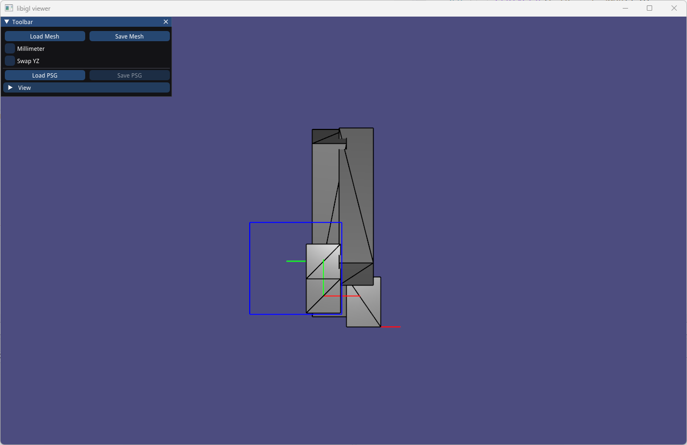
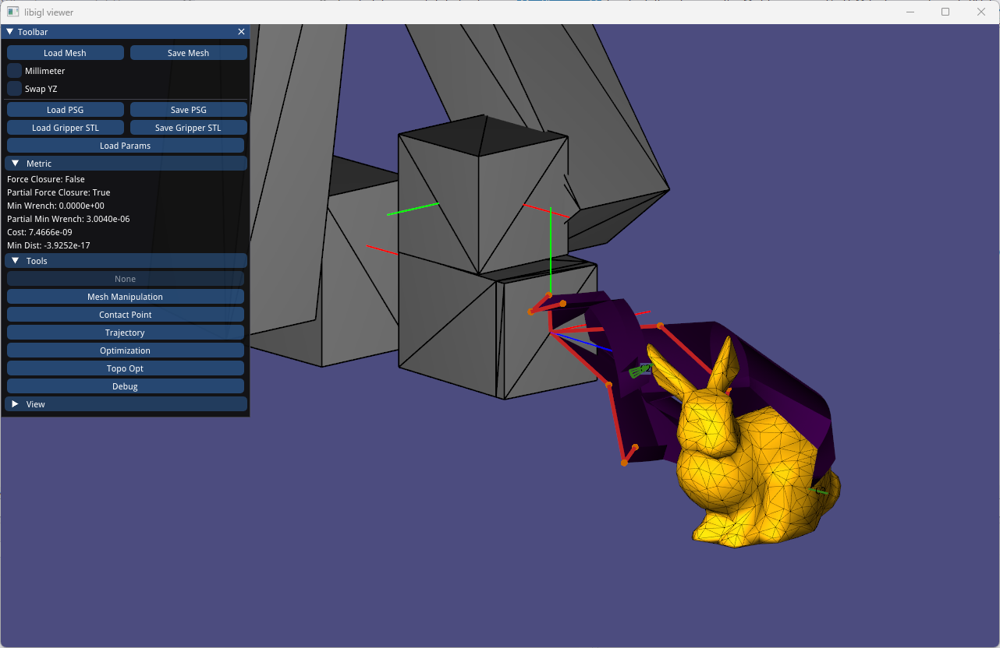
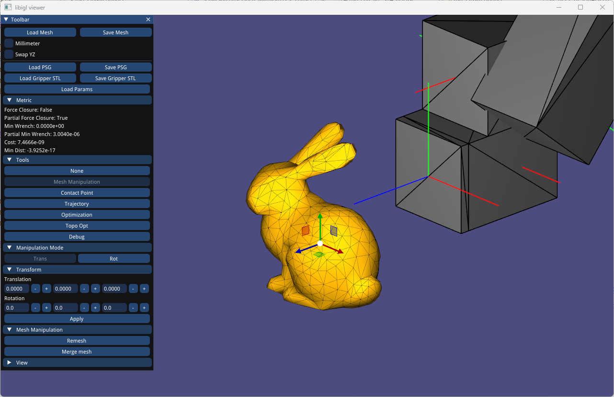
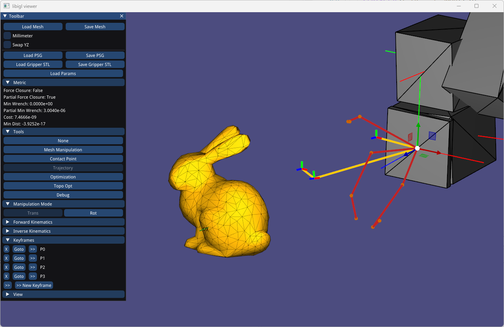
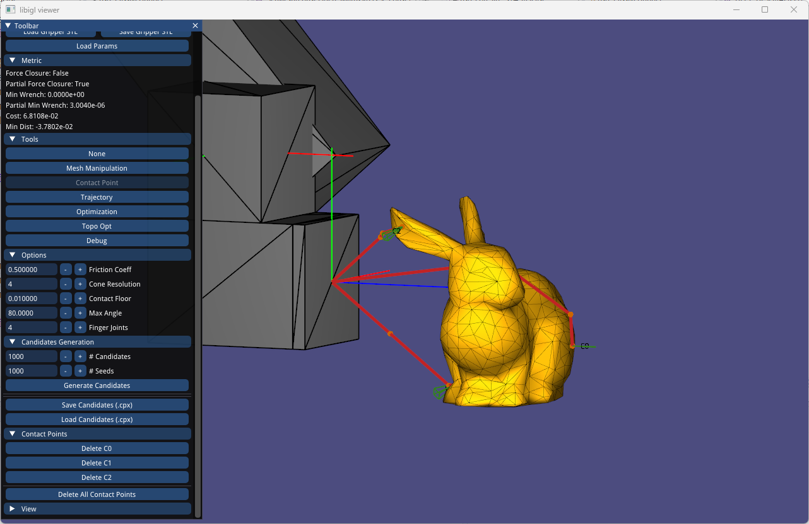
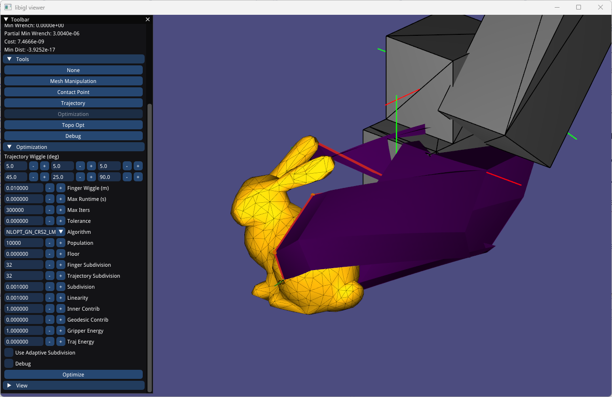
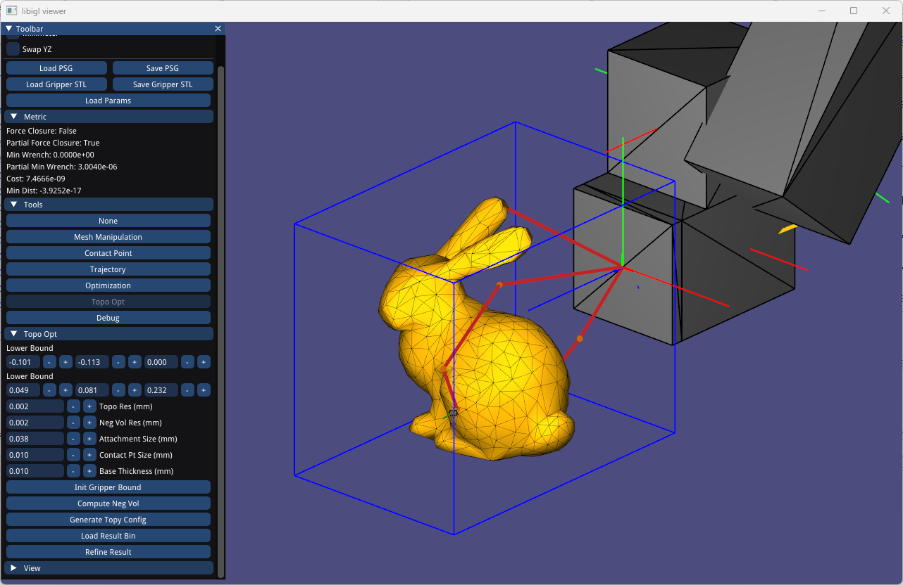
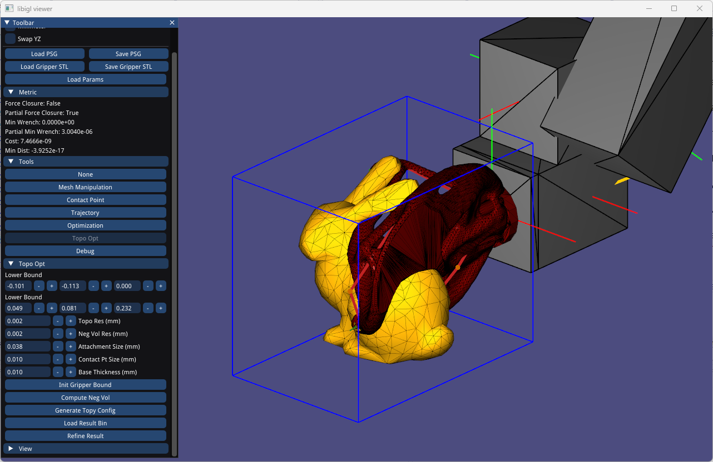
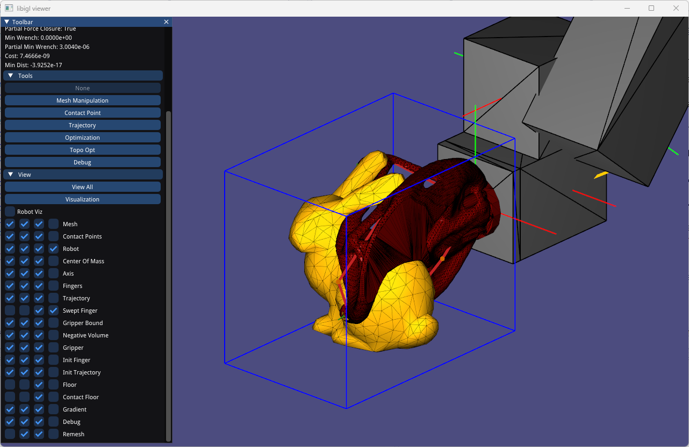

# Computational Design of Passive Grippers

[](https://api.reuse.software/info/github.com/milmillin/passive-gripper)

Public code release for ["Computational Design of Passive Grippers"](https://homes.cs.washington.edu/~milink/passive-gripper/), presented at SIGGRAPH 2022 and authored by Milin Kodnongbua, Ian Good, Yu Lou, Jeffrey Lipton, and Adriana Schulz.

You are permitted to use the code only for noncommercial purposes. See the [license section](#license) for details.

## Installation

```bash
git clone https://github.com/milmillin/passive-gripper.git
cd passive-gripper
git submodule update --init --recursive
```
### Dependencies

We use [vcpkg](https://github.com/microsoft/vcpkg) to handle dependencies. Install the following packages:

```bash
vcpkg install embree3:x64-[windows|linux]
vcpkg install qhull:x64-[windows|linux]
vcpkg install cgal:x64-[windows|linux]
vcpkg install nlopt:x64-[windows|linux]
```

We use [ToPy](https://github.com/milmillin/topy) library for topology optimization.

### Compilation

The compilation is done using the standard cmake routine. Inside the root project directory, run:

```bash
mkdir build
cd build
cmake .. -DCMAKE_TOOLCHAIN_FILE=[path to vcpkg]/scripts/buildsystems/vcpkg.cmake
cmake --build .

```

## Usage `passive-gripper`

You can begin by running `./build/passive-gripper`. A viewer should appear.



This user interface allows you to optimize for a passive gripper and an insert trajectory given an input mesh and related settings.
The "Tools" panel selects different functionalities of the program.



Following subsections will guide you to through the required steps:
- Import and manipulate mesh
- Specfify initial robot pose, object positioning, and related settings
- Generate grasp configurations (GCs).
- Optimize for an insert trajectory.
- Export `.tpd` Topy configuration.
- Load topology optimization result and refine for the final gripper design.

### Importing and Manipulating Mesh

You can start by clicking "Load Mesh" to import STL file. This assumes the STL file is in meter unit and Y-axis is up.
There are checkbox in case your STL file are in millimeter or Z-axis is up. 
After loading mesh, you can click on "Mesh Manipulation" to show the mesh-related functions.



- The mesh will be positioned at the default position in front of the robot arm in its default initial position.
- (Optional) You can reposition the mesh using the "Transform" pane and click apply. 
*Note the handle on the object is known to be unusable at the moment*
- (Required) "Merge Mesh" merges the disjoint component
- (Optional) "Remesh" processes the mesh so that it has roughly equal edge length.

### Specifying Initial Robot Pose

To specify the robot pose, click on the "Trajectory" button in the "Tools" pane.



- Initially, you will have one keyframe which is the keyframe where the gripper touches the object. **Note that the keyframe order here is reversed from what is described in the paper**.
- You can move to different keyframes by clicking "Goto" and you can delete the keyframe by clicking "X". *Note that you cannot delete the last keyframe*.
- To edit the keyframe, click ">>" on the keyframe you want to edit. 
	- Then use the handle on the robot arm to move it to the desired position.
	- You can toggle between translation and rotation handle by clicking "Trans" or "Rot" under the "Manipulation Mode" pane on the left.
	- You can expand the "Forward Kinematics" or "Inverse Kinematics" to manually enter the parameters.
- To manually add a new keyframe, click ">>" besides the "New Keyframe" label. Move the robot to the desired configuration, and then click ">> New Keyframe"
- **You do not need to add/edit keyframes other than the first because later stages will reinitialize the rest of the trajectory. You do not need to do anything if you want the robot in its default position**.

### Grasp Configuration Generation

You can click on the "Contact Point" under the "Tools" pane.



#### Options
- "Friction Coeff" is the base friction coefficient.
- "Cone Resolution" is the number of sides for the polyhedral cones used to approximate the friction cones.
- "Contact Floor" is the Y-coordinate of the floor. Points below this value will not be selected.
- "Max Angle" is the maximum angle the instantaneous motion heuristics has to follow (See theta_max in Section 4.2)
- "Finger Joints" is the number of joints per finger.
- "# Candidates" is the number of GCs to be considered before ranking.
- "# Seeds" is the number of individual contact points to be considered.

#### Operations
- Click on "Generate Candidates". This will generate a ranked list of GCs.
	- *Note that this may take a while*
    - In case the console reports "Low success rate", consider lowering the "Contact Floor" or increasing the "Max Angle".
- A list of candidate will appear, and you click "Select" to load the GC to visualization.
- The skeleton will automatically be generated and shown in red, and the contact cones are shown in green.
- The trajectory will also be automatically generated and shown in yellow. You can check it using the "Trajectory" tool.
- (Optional) You can manually pick the contact points by pressing Ctrl and left clicking on the mesh.
- (Optional) You can delete individual contact point by clicking "Delete C#".
- (Optional) You can save the GC candidates by clicking "Save Candidates (.cpx)" which you can load them later..

### Insert Trajectory Optimization

You can click on the "Optimization" under the "Tools" pane.



#### Options

- "Trajectory Wiggle" is how much the trajectory can deviate from the initial values.
- "Finger Wiggle" is how much the joint positions can deviate from the initial values.
- "Max Runtime" is the maximum runtime for the optimizer. Setting this value to zero permits unlimited time.
- "Max Iters" is the maximum number of iterations for the optimizer. Setting this value to zeros allow unlimited iterations.
- "Tolerance" is the threshold where the optimization terminates if the cost function goes below this value.
- "Algorithm" is the optimization algorithm provided by the NLOpt library.
- "Population" is the size of the population need by the optimizer. (See NLOpt documentation for more details).
- "Floor" is the Y-coordinate of the floor to determine the collision with the floor. **This value has to be below the "Contact Floor"**.
- "Finger Subdivision" is the number of subdivision for the gripper energy (i.e., the number of subdivisions along the trajectory).
- "Trajectory Subdivision" is the number of subdivision for the trajectory energy (i.e., the number of subdivisions along the skeleton).
- "Subdivision" is the distance between subdivisions (for adaptive subdivision)
- "Linearity" is the linearity tolerance when linearizing the trajectory.
- "Inner Contrib" is the contribution of the inner distance.
- "Geodesic Contrib" is the contribution of the wrap-around distance.
- "Gripper Energy" is the contribution of the gripper energy term.
- "Trajectory Energy" is the contribution of the trajectory energy term.
- "Use Adaptive Subdivision". When checked, use adaptive subdivisions with distance "Subdivisions". The "Finger Subdivision" and "Trajectory Subdivision" will be ignored. 
- "Debug" (for our debugging purpose only).

#### Operations

- Click on the "Optimize" button and the optimization should start.
- A small panel will appear above the "Tools" panel allowing you to pause the optimization and load the current best parameters.

### Topology Optimization

You can click on the "Topo Opt" under the "Tools" pane.



#### Options
- "Topo Res" is the size of voxels for topology optimization in meters.
- "Neg Vol Res" is the size of voxels for the negative swept volume.
- "Attachment Size" is the diameter of the circular disk that mounts the gripper to the robot
- "Contact Pt Size" is the diameter of the sphere around the contact point when refining the gripper.
- "Base Thickness" is the thickness of the mounting circular disk.

#### Operations
- (Required) Click on "Init Gripper Bound". This will appropriately finds the working area for the gripper shown in blue. You can manually adjust using the "Lower-" and "Upper bound" on the left.
- (Required) Click on "Compute Neg Vol". This may take a while and the negative volume should appear.
- (Required) Click on "Generate Topy Config". This will prompt you to save a `.tpd` file.
- (Required) Refer to ToPy documentation on how to perform topology optimization.

### Loading Topology Optimization Result

After topology optimization, a `.bin` file should be generated. Staying on the "Topo Opt" tool, click on "Load Result Bin" and browse to the `.bin` file.



This should load the gripper mesh. Then click on "Refine Result" to add the mounting disk and refine the geometry around the contact points.
You can select "Save Gripper STL" to export the gripper shape.

### Saving and Loading Configurations

You can save all the settings and parameters using the "Save PSG" button.
This will prompt you to save a `.psg` file which contains the mesh, the contact points, the skeleton, the trajectory, and all the settings.
You can hit "Load PSG" to load the saved configurations.

### View Options

You can hide and unhide some components on the viewport by expanding the "View" panel.



Here the four checkboxes are:
- Visibility
- Line Visibility
- Face Visibility
- Face-based shading

You can also check "Robot Viz" to show UR5 model but this will affect the viewing performance.

## License

Most of the code is licensed under the Computational Design of Passive Grippers Non-commercial License. See `LICENSES/LicenseRef-UW-Non-Commercial.txt` for the license text. Please note that some part of the code is protected by patents, including a pending patent by the University of Washington. The license does NOT release the rights related to the patents.

We use the REUSE standard to mark some codes and assets that come with different licences. The license information is contained in each file's header, in `.reuse/dep5`, or in a seperate license file. License texts are planced under the `LICENSES/` folder, with the license identifier as file name.

Here is a list of files that contains a license other than `LicenseRef-UW-Non-Commercial` (Updated 2022-07-11):

	'Apache-2.0' found in:
	* external/ikfast/

	'BSD-3-Clause' found in:
	* assets/

	'CC-BY-4.0' found in:
	* data/

	'CC-BY-SA-4.0' found in:
	* README.md
	* docs/

	'CC0-1.0' found in:
	* .clang-format
	* .gitignore
	* .gitmodules

	'GCC-exception-3.1' found in:
	* external/lapack/libgcc_s_sjlj-1.dll
	* external/lapack/libgfortran-3.dll
	* external/lapack/libquadmath-0.dll

	'GPL-3.0-or-later' found in:
	* external/lapack/libgcc_s_sjlj-1.dll
	* external/lapack/libgfortran-3.dll
	* external/lapack/libquadmath-0.dll
	* external/libigl/

	'LicenseRef-LAPACK-Modified-BSD' found in:
	* external/lapack/lapack-config-version.cmake
	* external/lapack/lapack-config.cmake
	* external/lapack/libblas.dll
	* external/lapack/libblas.exp
	* external/lapack/libblas.lib
	* external/lapack/liblapack.dll
	* external/lapack/liblapack.lib

	'LicenseRef-Qhull' found in:
	* include/passive-gripper/GeometryUtils.cpp
	* include/passive-gripper/GeometryUtils.h

	'LicenseRef-UC-Berkeley-Copyright-and-Disclaimer-Notice' found in:
	* include/passive-gripper/QualityMetric.cpp
	* include/passive-gripper/QualityMetric.h

	'MIT' found in:
	* external/autodiff/
	* external/swept-volumes/
	* include/passive-gripper/Constants.h
	* include/passive-gripper/SweptVolume.cpp
	* include/passive-gripper/SweptVolume.h

	'MPL-2.0' found in:
	* cmake/FindLIBIGL.cmake
	* external/libigl/
	* include/passive-gripper/GeometryUtils.cpp
	* include/passive-gripper/GeometryUtils.h
